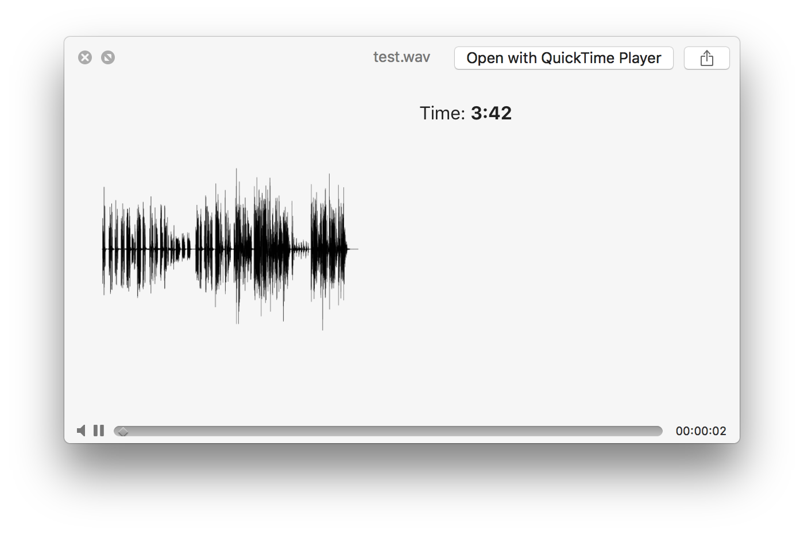

# QLWaveForm

by Takuho Yoshizu



Introduction
------------

QLWaveForm is a simple QuickLook generator for autio files.
It renders a preview of the waveform of the selected audio file.

Installation
------------

Simply copy QLWaveForm.qlgenerator to `~/Library/QuickLook` or `/Library/QuickLook`.

If you run into issues with macOS not letting you run the plugin because it's not signed by a verified developer you can follow these steps:

```
$ xattr -cr ~/Library/QuickLook/QLWaveForm.qlgenerator
$ qlmanage -r
$ qlmanage -r cache
```

If the newly installed plugin is not picked up instantly, you can run `qlmanage -r` in Terminal to refresh.

To uninstall, drag QLWaveForm into the trash.

Downloads
---------

Source code is available at <https://github.com/seagirl/QLWaveForm>.

You can download the [latest](https://github.com/seagirl/QLWaveForm/releases/latest) release from 
<https://github.com/seagirl/QLWaveForm/releases>


Version History
---------------
Version 1.0 - Jun 24, 2017

* Initial release.
